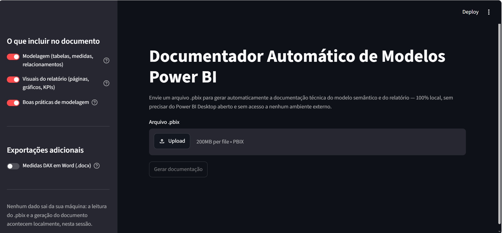
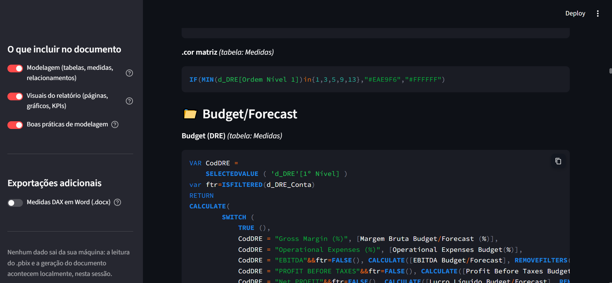
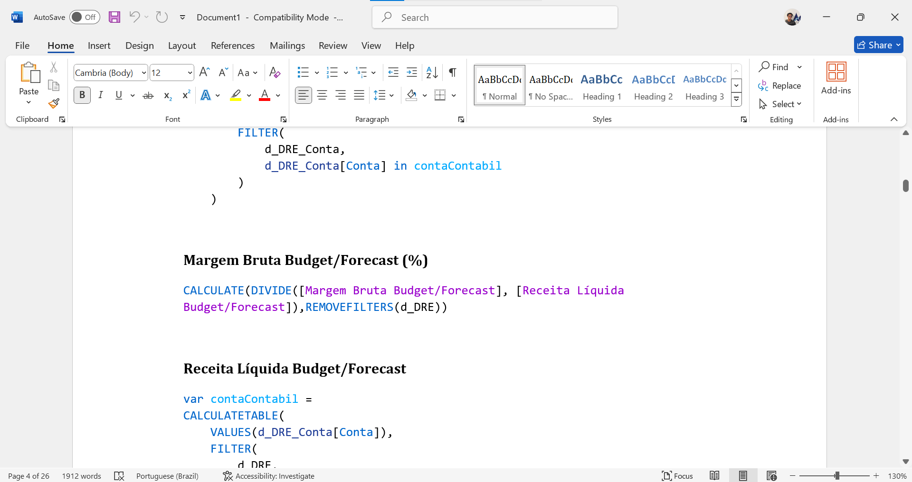

# Documentador Automático de Modelos Power BI

<table align="center">
  <tr>
    <td align="center">
      <br>
      <b>Tela inicial fundo dark</b>
    </td>
    <td align="center">
      <br>
      <b>Funcionamento do documentador</b>
    </td>
    <td align="center">
      <br>
      <b>Exportação DOCX</b>
    </td>
  </tr>
</table>

Ferramenta em Python que lê arquivos `.pbix` localmente (sem precisar do Power BI
Desktop aberto e sem acesso a ambientes externos) e gera automaticamente uma
documentação em Markdown combinando até três seções **independentes**:

1. **Modelagem** — tabelas, colunas, relacionamentos, medidas DAX e código Power Query (M).
2. **Visuais do relatório** — páginas, tipos de visual (gráficos, KPIs, tabelas, segmentações) e quais medidas/colunas cada um usa.
3. **Boas práticas** — pontos de atenção sobre a modelagem (regras heurísticas).

Cada uma tem seu próprio toggle na interface; qualquer combinação é permitida
(as três, só uma, ou duas quaisquer). Também há uma exportação independente em
Word (`.docx`) contendo somente as medidas DAX do modelo.

## Estrutura

```
documentador-powerbi/
├── src/
│   ├── extracao.py          # Extração do modelo semântico (pbixray)
│   ├── extracao_visuais.py  # Extração de páginas/visuais (Report/Layout)
│   ├── modelos.py           # Dataclasses/pydantic (Tabela, Medida, Visual, Página...)
│   ├── linter.py            # Regras de boas práticas (opcional)
│   ├── exportador_medidas.py # Exportação DOCX somente das medidas DAX
│   ├── gerador.py           # Orquestração das 3 seções + renderização Jinja2
│   └── app.py                # Interface Streamlit
├── templates/
│   ├── documento.md.j2            # Template mestre (inclui as seções ativas)
│   ├── secao_visao_geral.md.j2    # Sempre incluída
│   ├── secao_modelagem.md.j2      # Só se "Modelagem" ativado
│   ├── secao_visuais.md.j2        # Só se "Visuais" ativado
│   └── secao_boas_praticas.md.j2  # Só se "Boas práticas" ativado
└── requirements.txt
```

## Status

Implementado e testado (extração real com `pbixray` para o modelo semântico,
um parser próprio para a camada de visuais e exportação `.docx` das medidas
DAX).

## Instalação e uso

```bash
pip install -r requirements.txt
streamlit run src/app.py
```

Depois é só abrir o endereço indicado pelo Streamlit, enviar um `.pbix`,
escolher quais das três seções incluir, opcionalmente ativar a exportação das
medidas DAX em Word, e clicar em "Gerar documentação".

## Uso via código (sem interface)

```python
import sys
sys.path.insert(0, "src")  # ou rode com PYTHONPATH=src

from extracao import extrair_modelo, RelatorioSemModeloError
from exportador_medidas import gerar_docx_medidas
from gerador import renderizar_documentacao

caminho = "caminho/para/seu-arquivo.pbix"

try:
    modelo = extrair_modelo(caminho)
except RelatorioSemModeloError:
    modelo = None  # thin report: ainda dá pra documentar os visuais

documento = renderizar_documentacao(
    modelo,
    caminho_pbix=caminho,
    incluir_modelagem=True,
    incluir_boas_praticas=True,
    incluir_visuais=True,
)
print(documento)

if modelo is not None:
    with open("medidas_dax.docx", "wb") as arquivo:
        arquivo.write(gerar_docx_medidas(modelo))
```

## Design das três seções independentes

Cada seção só é processada/rodada se o seu toggle estiver ativo — sem
condicionais espalhadas em um template único:

- **Modelagem desativada**: `secao_modelagem.md.j2` nem é incluída no
  documento; nenhum processamento extra acontece.
- **Boas práticas desativada**: `linter.py` nunca é chamado.
- **Visuais desativado**: `extracao_visuais.py` nunca é chamado (o
  `Report/Layout` do .pbix nem é lido).

Essa decisão acontece inteiramente dentro de `renderizar_documentacao()`, em
`src/gerador.py`, que monta o contexto e decide quais templates parciais
incluir através do template mestre `documento.md.j2`.

### Caso especial: thin reports (sem modelo embutido)

Quando o `.pbix` não tem modelo semântico embutido (conexão ao vivo a um
workspace do Power BI Service ou a um Analysis Services), `extrair_modelo()`
levanta `RelatorioSemModeloError` — mas a camada de **visuais** é
independente do modelo e continua disponível. Por isso, `renderizar_documentacao()`
aceita `modelo=None`: nesse caso as seções de modelagem e boas práticas são
automaticamente desativadas (com uma nota explicativa no documento), mas a
seção de visuais ainda pode ser gerada normalmente — inclusive com títulos de
KPIs e campos usados em cada gráfico.

### Sobre a extração de visuais

Ao contrário do modelo semântico (lido via `pbixray`, biblioteca mantida com
uma API estável), a camada de visuais é lida diretamente do `Report/Layout`
dentro do `.pbix` — um JSON cujo formato **não é documentado oficialmente
pela Microsoft** (foi obtido por engenharia reversa da comunidade Power BI).
A extração em `extracao_visuais.py` é, portanto, deliberadamente
*best-effort*: tipos de visual não reconhecidos aparecem com o nome técnico
bruto, e referências de campo mais complexas (agregações aplicadas
diretamente pelo visual, campos calculados no próprio relatório) são
mostradas em sua forma bruta, em vez de travar a geração do documento.

## Autor

Desenvolvido por Samuel da Rocha Villela
